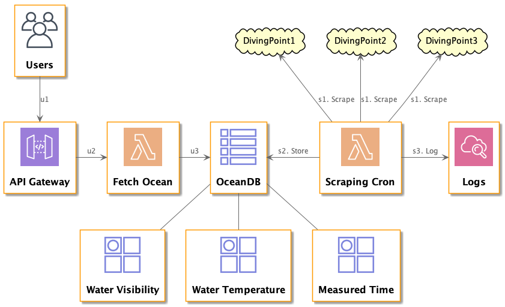
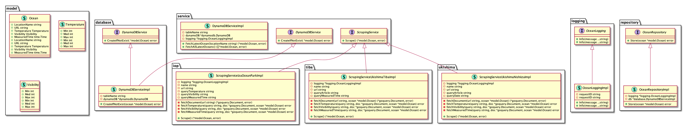

## System Diagram



Generated by [VSCode extension PlantUML](https://marketplace.visualstudio.com/items?itemName=jebbs.plantuml)

## Class Diagram



### Generate Command

```
$ goplantuml -recursive ./scraping > docs/class.puml
```

## Development

### DynamoDB Local Admin using dynamodb-admin

``` console
$ npm install dynamodb-admin -g
$ dynamodb-admin
```


## Directory tree

This is a sample template for divers-ocean-map - Below is a brief explanation of what we have generated for you:

```bash
.
├── Makefile                    <-- Task runner (test, build, deploy)
├── README.md                   <-- This file
├── scraping                    <-- Source code for scraping lambda function
│   └── logging                 <-- Logging Library
│   └── model                   <-- Models
│   └── service                 <-- Main business logic
└── template.yaml               <-- generates cloudformation templates
```

## Requirements

* AWS CLI already configured with Administrator permission
* [Docker installed](https://www.docker.com/community-edition)
* [Golang](https://golang.org)
* SAM CLI - [Install the SAM CLI](https://docs.aws.amazon.com/serverless-application-model/latest/developerguide/serverless-sam-cli-install.html)

## Setup process

### Golang installation

Please ensure Go 1.x (where 'x' is the latest version) is installed as per the instructions on the official golang website: https://golang.org/doc/install

A quickstart way would be to use Homebrew, chocolatey or your linux package manager.

#### Homebrew (Mac)

Issue the following command from the terminal:

```shell
brew install golang
```

If it's already installed, run the following command to ensure it's the latest version:

```shell
brew update
brew upgrade golang
```

### Local DynamoDB setup

#### Local DynamoDBの立ち上げ

``` shell
$ docker-compose up
```

#### 管理画面の立ち上げ

``` shell
$ dynamodb-admin
```